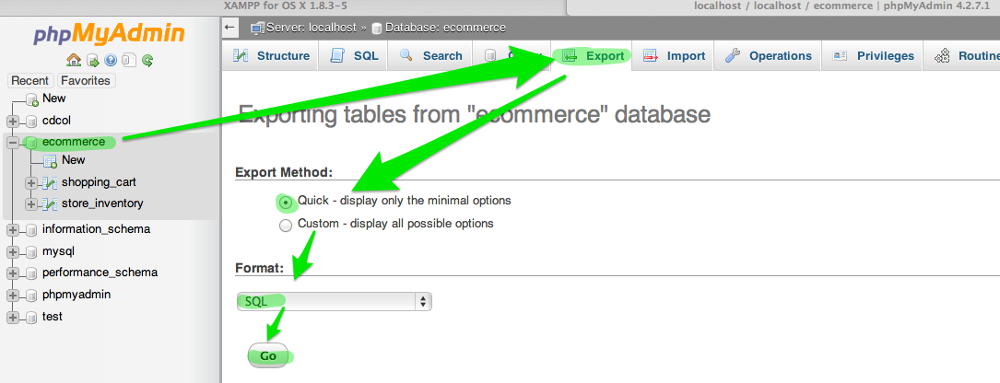

Reminder - There will not be in class demonstrations of the project.

# Instructions for Submitting Shopping Cart Project

* Code
* SQL for Database
* Two-page project write-up

## Code

Given most students selected PHP to implement the eCommerce site, the instructions will be based on that. If you used something else, do you best to apply the guidance to your situation, and ask for help if you need it.

Locate the folder that contains your PHP code. For example, on my site, there is a folder named htdocs and I have a sub-folder named ecommerce. The ecommerce folders contains all of the files needed for my project. Create a zip archive of the folder that contains all of your project files. 

## SQL for Database

In XAMPP, or your host, look for and launch myPHPAdmin. You are going to use the Export function to create an SQL export of your database, which will include statements that will enable someone to recreate your database structure and populate the database with the same set of data you have. You may need to update your data if you've been testing and need to restock or add additional items for proper testing of your site.

1. Launch/log in to phpMyAdmin
2. Select your database from the navigation panel on the left hand side.
3. Click the Export tab along the top of the main panel.
4. In the "Exporting tables" dialog, choose the Quick Export Method and choose SQL for the Format, then click the Go button.
5. A file download should begin for the SQL that is created. Pay attention to where the file is saved and move it to the same location as your zipped code.

If you did not use MySQL or do not have access to phpMyAdmin, please find another way to provide the SQL to create the tables and populate with test data.

## Two-page project write-up

Dr. Abraham asked that you include a two-page project summary. Several have asked if images were allowed, such as screen shots. Images do not count toward the two-page guideline. Save a copy of the project summary and move it to the same location as your zipped code and SQL file. Also, print a hard copy for Dr. Abraham. Guidelines for formatting, 11 or 12 pt Times New Roman, 1-inch margins, in Microsoft Word (readable) format.

__You must include references, with links, to sources used for the project, including tutorials/guides.__

# Electronic submission - Submit to Joel Garza

1. Address an email to jagarzan@broncs.utpa.edu
2. Use subject = CSCI6314_project for <your full name>
3. Attach three files
    * zipped code folder
    * SQL for database
    * project write-up
4. Include any special notes for setting up, if you did not use XAMPP/PHP, and testing your site
5. Include a link if you have a live instance hosted somewhere
6. Email is due Thursday

# Hard copy submission - Submit to Dr. Abraham

1. Bring a folder
2. Place in the folder:
    * printed hard copy project write-up
    * Include a CDROM with the zipped code folder, SQL for database, and project write-up
    * If you have a link to a live instance, write it on the top of your printed hard copy project write-up
3. Bring folder to class for Dr. Abraham

If you have trouble creating the CDROM before class, and you send the email to Joel before the start of class, he will create the CDROM with your files for you.

If you have already created the CDROM with your site code files before reading this notice, you do not need to recreate it.
